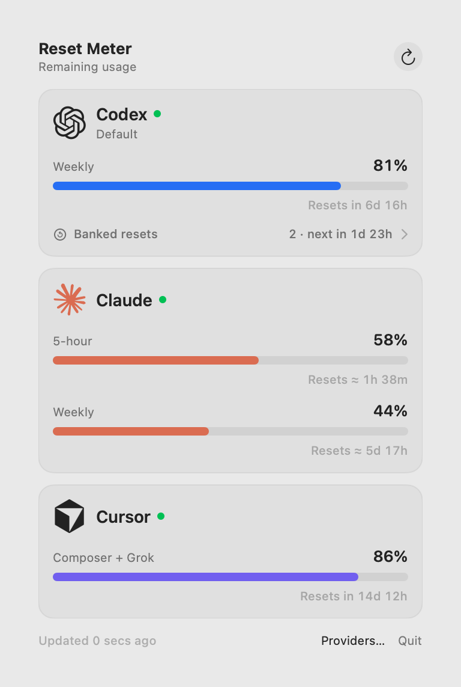

# Reset Meter

[](https://github.com/RZDESIGN/reset-meter/actions/workflows/ci.yml)

A lean, native macOS menu-bar meter for the remaining usage in Codex, Claude, and Cursor.

Reset Meter keeps each provider's logo, a compact capacity bar, and the remaining percentage visible in the menu bar. A provider with several accounts shows its logo once, followed by one bar per account. Open it for every available usage window and its reset countdown.

## Preview

<p align="center">
  
</p>

<p align="center">
  
</p>

The preview uses synthetic demo values generated by the app. It contains no account or desktop data.

## Install

Reset Meter supports macOS 14 or later on Apple Silicon and Intel Macs.

1. Download the latest DMG from [Releases](https://github.com/RZDESIGN/reset-meter/releases/latest).
2. Open it and drag **Reset Meter** to **Applications**.
3. Launch Reset Meter. It runs only in the menu bar, so it does not appear in the Dock.

The current community build is not Apple-notarized. On first launch, Control-click the app, choose **Open**, then confirm. A Developer ID-signed and notarized build can replace it without changing the app or installer scripts.

## Provider support

| Provider | What Reset Meter reads | Requirement |
| --- | --- | --- |
| Codex | The CLI's read-only `account/rateLimits/read` response | Codex CLI installed and signed in |
| Claude | Claude Desktop's local `plan-usage-history.json` cache | Claude Desktop installed and used at least once |
| Cursor | Cursor's local sign-in token, used for its current-period usage request | Cursor installed and signed in |

Claude's local cache does not include reset timestamps. Reset Meter estimates the active rolling-window reset from the usage history and marks it with `≈`. Codex and Cursor currently expose live reset timestamps.

These integrations use local or provider-internal interfaces rather than stable public usage APIs. A provider update can require a corresponding Reset Meter update.

## Multiple Codex subscriptions

Open the menu-bar popover and select **Providers…**. Your existing Codex CLI login appears as **Default**; rename it to something recognizable, such as **Personal**.

To connect another subscription, enter a name such as **Work**, click **Add & Sign In**, and complete the browser sign-in with that subscription's ChatGPT account. If the browser is already signed in to your first account, switch to the other account during sign-in. Each account gets its own menu-bar meter behind the single Codex logo, and its own named usage card, in the same order as the Providers panel. Percentages and reset windows stay separate.

Added accounts use isolated Codex login directories under `~/Library/Application Support/Reset Meter/Codex Accounts/`. They do not change the default CLI login. Names and account identifiers persist across app restarts. Use **Sign In** to reconnect an account; the trash button removes an added account and its local Reset Meter login. The default connection continues to follow your current CLI login.

Codex manages file-based credentials inside each added account's private directory. Reset Meter stores no credentials in preferences and never logs them. This uses Codex's documented [`CODEX_HOME` and credential storage settings](https://learn.chatgpt.com/docs/auth).

## Provider details and visibility

Click the mini meters to see each Codex account's **Banked resets** line: the available count and when the next one expires. Click that line to expand the expiry date and countdown for every available reset. These come from the same read-only Codex status request as usage limits. If Codex provides only a count or a partial detail list, the expanded list marks the missing expiry details as unavailable; an unavailable count is never displayed as zero. Viewing the panel does not redeem resets.

The dot beside each provider name shows whether its reading is live (green) or stale (orange). Hover it for the source of the reading.

Open **Providers…** for the same usage bars, remaining percentages, and reset countdowns shown in the popover, for every Codex account, Claude, and Cursor. Use the **All**, **Codex**, **Claude**, and **Cursor** tabs to find a provider.

Each entry has a **Show** switch. Turning it off hides that entry from the menu bar and popover while keeping its connection and usage details available in Providers. This also works for the default Codex connection, so you can hide it when a separately added account tracks the same subscription. Visibility choices survive restarts. If all entries are hidden, a small Reset Meter icon remains so you can open Providers and turn them back on.

## Privacy

- Usage requests go directly to the respective provider: Codex through its CLI, and Cursor through its usage endpoint. Account sign-in uses Codex's browser login.
- Cursor's access token is read only when refreshing, held in memory, sent only to `api2.cursor.sh`, and never logged or saved by Reset Meter.
- Codex is queried through the locally installed CLI process.
- Additional Codex accounts have separate local login directories; removing one deletes that account's Reset Meter login directory.
- Claude data is read from its local Desktop cache.
- Reset Meter does not read prompts, conversations, browser cookies, or repository contents.
- Reset Meter has no analytics, telemetry, crash reporter, or update tracker.

Do not attach real usage files, access tokens, or unredacted screenshots to public bug reports.

## Build from source

Requirements:

- macOS 14 or later
- Xcode command-line tools with Swift 6

```sh
git clone https://github.com/RZDESIGN/reset-meter.git
cd reset-meter
swift test
./scripts/build-app.sh
```

The build script creates a universal, ad-hoc-signed app at `dist/Reset Meter.app`.

Create a drag-to-Applications DMG:

```sh
./scripts/package-dmg.sh
```

## Signed releases

For Gatekeeper-trusted public distribution, export a Developer ID Application identity and a `notarytool` keychain profile:

```sh
export RESET_METER_SIGN_IDENTITY="Developer ID Application: Example (TEAMID)"
export RESET_METER_NOTARY_PROFILE="reset-meter-notary"
./scripts/package-dmg.sh
```

The script signs the universal app with the hardened runtime, signs the DMG, submits it to Apple's notary service, and staples the returned ticket.

## Project notes

- Provider parsing and reset calculations live in `UsageMeterCore` and have unit tests.
- The menu-bar label is rendered as one native template image because macOS does not reliably preserve nested SwiftUI views inside a `MenuBarExtra` label.
- Provider marks are used only to identify their respective services. See [Third-party notices](THIRD_PARTY_NOTICES.md).

## License

The source code is available under the [MIT License](LICENSE). Third-party names, marks, and artwork are excluded from that license.

Reset Meter is an independent community project. It is not affiliated with, sponsored by, or endorsed by OpenAI, Anthropic, Cursor, or Apple.
